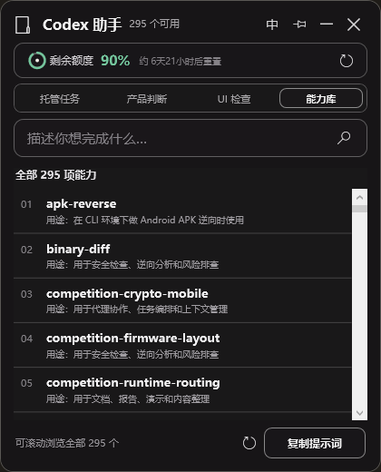

# Codex Skill 中文助手

一个面向普通中文用户的 Windows 桌面小组件：把“我感觉不对，但不知道该怎么说”转换成清晰、可执行、可验收的 Codex 提示词。



## 为什么做它

很多人有行业经验、产品想法和审美判断，却没有系统的开发或设计训练。使用 Codex 修改开源项目时，常遇到这些问题：

- 明知道实现偏离了原型，却说不清具体错在哪里；
- 看得出 UI 不对，但不会表达对齐、间距、裁切等专业问题；
- 产品方案听起来不合理，却只能收到笼统、奉承式的回答；
- 想把任务托管给 Codex，却不知道提示词里该写哪些边界和验收条件；
- 英文 Skill 太多，不知道每一个到底有什么用；
- 不清楚剩余额度和重置时间。

这个项目的原则是：后台可以复杂，前台必须轻量、清楚、无负担。

## 当前功能

- 四种工作模式：托管任务、产品判断、UI 检查、能力库；
- 扫描本地 Codex Skills，并为每项能力提供中文用途说明；
- 普通模式从完整目录中推荐最多 6 项，能力库可浏览全部项目；
- 用中文搜索 Skills，并用历史高频词增强推荐；
- 生成带范围、风险边界和验收要求的中文提示词；
- 显示 Codex 剩余额度与预计重置时间；
- 从 GitHub 搜索候选 Skill，先隔离和静态审核，再决定是否安装；
- 小、标准、大三档窗口，自动限制在屏幕工作区内；
- 支持置顶、拖动、折叠和本地设置保存。

## 运行要求

- Windows 10/11
- Windows PowerShell 5.1
- 已安装并使用过 Codex Desktop / Codex CLI

下载项目后，双击：

```text
Run-CodexSkillWidget.bat
```

也可以先验证本地环境：

```powershell
powershell.exe -NoProfile -ExecutionPolicy Bypass -STA -File .\Start-CodexSkillWidget.ps1 -ValidateOnly
```

## 隐私与安全

- 查询历史、窗口设置、日志和隔离下载内容只保存在本机，并已从 Git 排除；
- 工具不会上传你的源码或本地 Skill 内容；
- GitHub 补充功能只使用搜索词，并对候选内容做静态安全检查；
- 自动审核不能替代人工判断，不应安装来源不明的代码。

## 项目方向

这个项目首先解决真实的个人痛点，再逐步验证是否也能帮助更多普通用户。未来可能探索真实任务阶段、线程汇总、日报周报和原型差异检查，但不会为了功能数量把小组件变成沉重的项目管理平台。

更完整的产品想法见 [产品愿景](docs/PRODUCT_VISION.md)。欢迎提出问题、改进中文解释、补充测试或贡献更好的交互方案。

## 参与贡献

请阅读 [CONTRIBUTING.md](CONTRIBUTING.md)。安全问题请按 [SECURITY.md](SECURITY.md) 中的方式处理，不要公开可能泄露凭据的细节。

## 协议

使用 [MIT License](LICENSE)。你可以自由使用、修改和分发，但需保留原始版权与许可声明。
